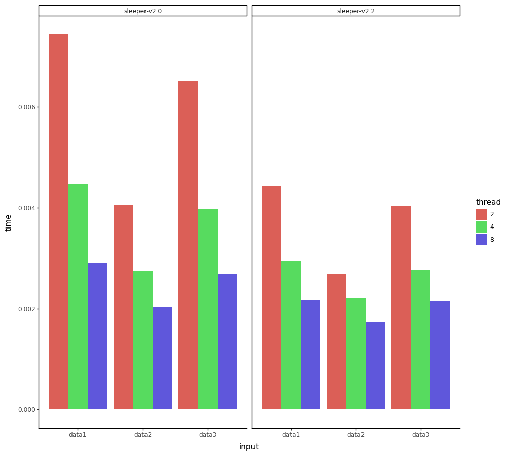

# General Description

Benchmarker is a tool used for automatic benchmarking of software. 


User can specify commands to be run before and after taking measurement to prepare the environment using a configuration file.

# Usage

To use the program, first install dependencies:
<!--name="dependencies"-->
```bash
apt install python3-venv -y
```
and then create a Python virtual environment:
<!--name="install"-->
```bash
python3 -m  venv .venv
source .venv/bin/activate
pip install -r requirements.txt
```

Configure the application by editing the YAML configuration file.
Then pass configuration file's name as an argument.
For example, start the benchmark by typing this command:
<!--name="run"-->
```bash
python src/main.py config.yml
```

To regenerate the output without re-running benchmarks, use `--update-output`:
<!--name="update-output"-->
```bash
python src/main.py config.yml --update-output result.csv
```

To see available command line arguments type:
<!--name="help-information"-->
```
python src/main.py --help
```

## Configuration

Benchmarker is configured using a YAML file, e.g.:

<!-- name="config.yml" -->
```yaml
---
system:
  isolate-cpus: [0,1]
  disable-aslr: True
  governor-performance: False
matrix:
  thread: [2, 4, 8]
  tag: ["slow", "fast"]
  input: ["data1", "data2", "data3"]
run:
  samples: 3
  save-output: "run.log"
  before:
    - "git clone . ../sleeper"
    - "cd ../sleeper && git checkout $matrix.tag && make build"
  benchmark:
    - "../sleeper/sleeper $matrix.thread $matrix.input"
  after:
    - "cd ../sleeper && make clean"
    - "rm -rf ../sleeper"
output:
  csv:
    filename: "result.csv"
    format: "csv"
  plot:
    filename: "plot.png"
    format: "bar-chart"
    x-axis: input
    facet: tag
    color: thread
    width: 10
    height: 9
    dpi: 100
  table:
    format: "table-md"
    filename: "table.md"
    columns: ["tag", "input"]
```

### Matrix

Based on that config, Benchmarker will run a benchmark for each value specified in `matrix.*` fields.
It will then store the results in the `output.name` file.
Commands specified as strings in `run` field will be executed with every substring beginning with `$matrix.` being substituted to corresponding variable.
For each combination of variable values, a run will be performed, e.g.:  
The above configuration will result in runs:  
`$matrix.thread = 2; $matrix.input = "data1"; $matrix.commit = "abc123"`  
`$matrix.thread = 4; $matrix.input = "data1"; $matrix.commit = "abc123"`  
`$matrix.thread = 8; $matrix.input = "data1"; $matrix.commit = "abc123"`  
[...]  
`$matrix.thread = 8; $matrix.input = "data3"; $matrix.commit = "cba321"`
in total performing 27 benchmarks.
If there is no `matrix` section, Benchmarker will execute the `run` section once.

### Run

* `samples` (optional, default = 1) defines how many times repeat each benchmark.
* `save-output` (optional, default = None) defines where to save the stdout and stderr of the benchmarked commands. If set to `"STDERR"` or `"STDOUT"`, the output will be printed to standard error or standard output respectively.
* `before` contains the commands to be executed before the benchmark. 
* `benchmark` contains the commands to be benchmarked.
* `after` contains the commands to be executed after the measurement. 
The `before` and `after` sections are optional.
* `metrics` (optional, default = `["time"]`) a list of metrics to be gathered from benchmarked commands.
Built-in are: `time`, `stderr`, `stdout` and `exit-codes`.
User can also specify their own metric using `metric_name@command` syntax.
See: [Custom Metrics](#custom-metrics)

### System

The `system` section allows the user to apply variance reduction measures.
When benchmarking in a regular system environment, external factors such as other processes or randomized memory layout can affect the measurements.
Options in this section aim to minimize some of the external factors. 
Using these options require Benchmarker to be run with root privileges.
The section is optional; if no options are specified, Benchmarker can be run without root.

* `isolate-cpus`: contains a list of CPUs which will be shielded from running processes other than benchmarks.
* `disable-aslr`: if set to `True`, will disable address space layout randomization. 
* `governor-performance`: if set to `True`, will set frequency governors of all (or isolated) CPUs to `performance`.

### Output

In the `output` section user can specify desired output of the program.
Each subsection of the `output` corresponds to one output file described by `filename` and `format`.
Currently there are three supported formats: `csv`, `bar-plot` and `table-md`.

`csv` output will contain columns corresponding to variables and one column with benchmark results.

`bar-plot` will result in a `.png` image containing the plot.
Configure using these options:
* `x-axis` (mandatory): contains name of the variable which will be used as x-axis on the plot.
* `facet` (optional): contains name of the variable which will be used to facet (divide into subplots) the plot.
* `width` (optional, default = 10in): width of resulting image in inches.
* `height` (optional, default = 9in): height of resulting image in inches.
* `dpi` (optional, default = 100): DPI of resulting image.

`table-md` will result in a text file containing a markdown table. 
Configured using these options:
* `columns` (optional, default - include all columns): contains an array of variable names which will be used to group the results in the table.

For example, the config above will generate this `plot.png`:



And this `table.md`:
```markdown
| tag   | input   |     mean |   median |       std |
|:------|:--------|---------:|---------:|----------:|
| fast  | data1   | 0.292805 | 0.251214 | 0.165203  |
| fast  | data2   | 0.147003 | 0.125923 | 0.0827682 |
| fast  | data3   | 0.409555 | 0.350952 | 0.231543  |
| slow  | data1   | 0.409459 | 0.350861 | 0.231534  |
| slow  | data2   | 0.152782 | 0.130948 | 0.0860583 |
| slow  | data3   | 0.438692 | 0.376356 | 0.248082  |
```

### Custom Metrics

Benchmarker allows usage of custom metrics.
To use a custom metric specify metric name and command in `run.metrics` using syntax `metric_name@command`.
`command` must be an executable which should accept benchmark commands as arguments.
 e.g.:
```yaml
---
matrix:
  size: ["5M", "10M", "15M"]
run:
  benchmark:
  - "truncate -s $matrix.size bar"
  - "fallocate -l $matrix.size foo"
  after:
  - "rm foo bar"
  metrics: ["time","size_diff@./measure_size_diff"]
output:
  csv:
    filename: "file_sizes.csv"
    format: "csv"
  table:
    format: "table-md"
    filename: "size_diff_table.md"
    result-column: "size_diff"
```
where `./measure_size_diff` is path to executable written in C:
```C
#include <stdio.h>
#include <stdlib.h>
int main(int argc, char**argv) {
  system(argv[1]); // run `truncate -s $matrix.size bar`
  system(argv[2]); //run `fallocate -l $matrix.size foo`
  FILE* bar = fopen("bar","r");
  FILE* foo = fopen("foo","r");
  fseek(foo, 0L, SEEK_END);
  int foo_size = ftell(foo);
  fseek(bar, 0L, SEEK_END);
  int bar_size = ftell(bar);
  printf("%d", foo_size - bar_size); // pass the result to the Benchmarker
  fclose(bar);
  fclose(foo);
  return 0;
}
```
The Benchmarker will pass commands `truncate -s $matrix.size bar` and `fallocate -l $matrix.size foo` as arguments to `./measure_size_diff`.
`./measure_size_diff` then executes commands and compares the size of created files, printing result to `stdout`.
The result is then stored in column `sie_diff` and can be accessed under that name when generating output.